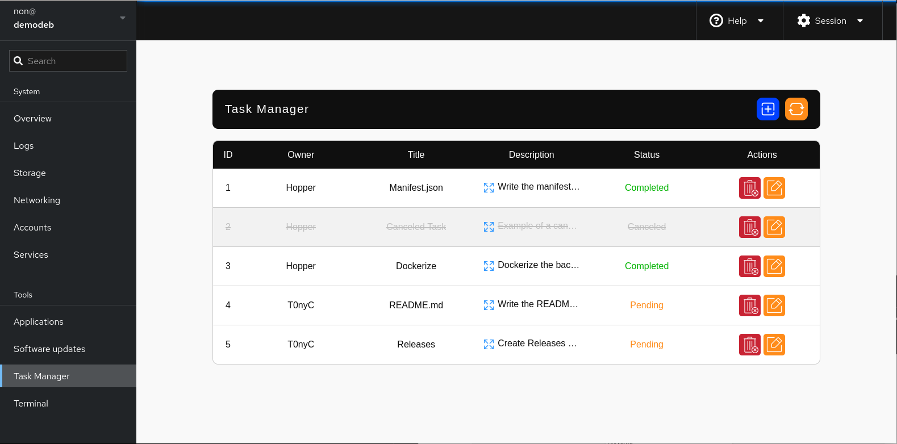
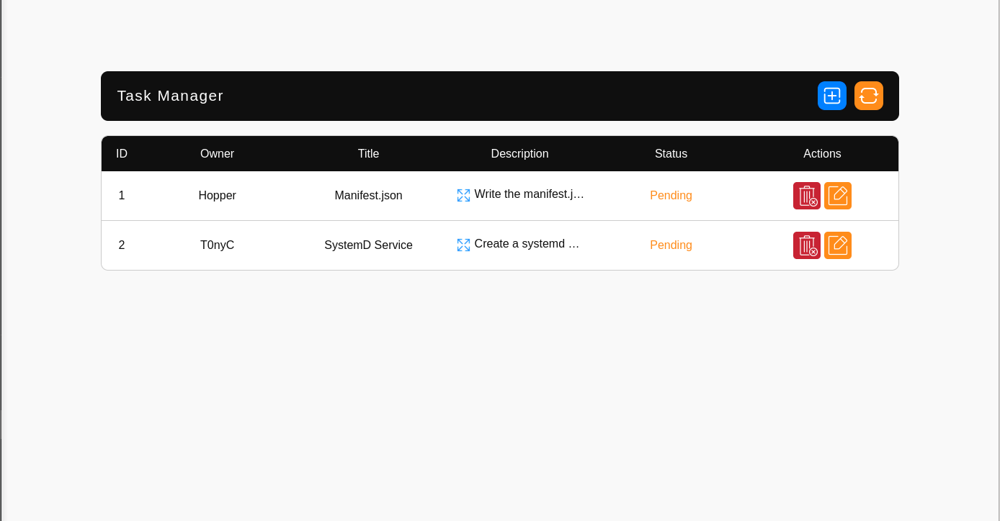
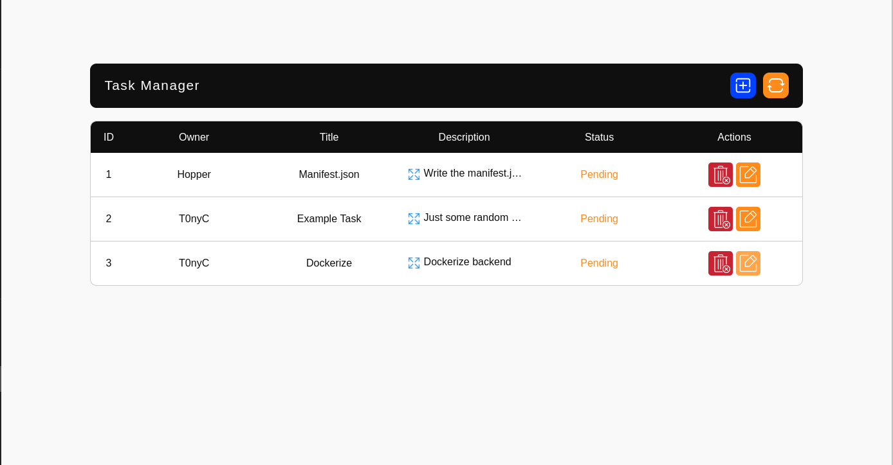

# Cockpit Task Manager

A simple TO-DO/task manager plugin for Cockpit.

# About

The Cockpit Task Manager plugin is a collaborative To-Do list designed for organizing and managing project tasks in group projects. It utilizes a Python Flask application for creating, updating, and deleting tasks, which are stored in a SQLite database. 

Using the Task Manager Interface, you can add a new task by providing a task owner, a task title, and a description. The default task status is `Pending`, which you can modify to `Completed` or `Canceled`. Additionally, you can edit the previously mentioned task details.

| Task Manager Interface|
|-----------------------|
||

## Adding and editing tasks preview

| Adding New Task | Editing Task |
|-----------------|--------------|
|||

# Installation

The Task Manager plugin has been tested on **Debian 12**, but it should work on other Debian-based systems as well.

## Prerequisites

First, you need to have the `python3-venv` package installed on your system wich you can install by running:
```sh
sudo apt install python3-venv
```
## Installation using a script

todo

## Installation using a .deb package

You can get the [latest](https://github.com/t0nyc23/cockpit-task-manager/releases/latest) `.deb` package and download it on your system. Then, from the same directory where the `.deb` file is downloaded, run the following command:

```sh
sudo apt install ./cockpit-task-manager_(version).deb
```
